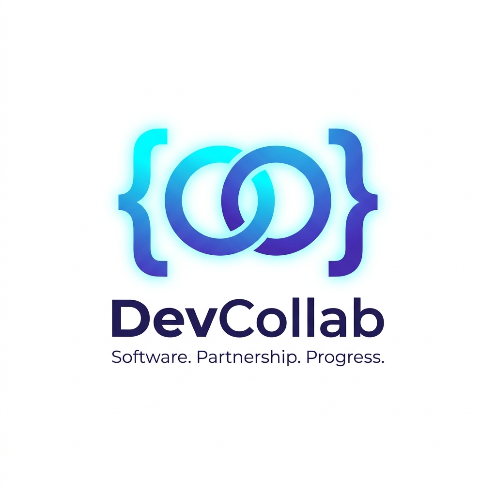

<h1 align="center">
  <br>
  
  <br>
  DevCollab: Real-time Collaborative Code Editor
  <br>
</h1>

<h4 align="center">A high-performance, real-time collaborative code editor with integrated local execution engine.</h4>

<p align="center">
  <a href="https://reactjs.org/"></a>
  <a href="https://nodejs.org/"></a>
  <a href="https://socket.io/"></a>
  <a href="https://www.docker.com/"></a>
</p>

<p align="center">
  <a href="#features">Features</a> •
  <a href="#execution-engine">Execution Engine</a> •
  <a href="#tech-stack">Tech Stack</a> •
  <a href="#installation">Installation</a> •
  <a href="#docker-setup">Docker Setup</a> •
  <a href="#contributing">Contribute</a>
</p>

---

## 🚀 Introduction

**DevCollab** is a powerful real-time collaborative environment designed for developers, teams, and technical interviewers. It revolutionizes the way you code together by providing a seamless, low-latency editing experience combined with a **high-performance local execution engine**.

Code together, debug in real-time, and execute instantly—all within your browser.

<br>
<p align="center">
  
</p>
<br>

## ✨ Features

- **👨‍💻 Real-time Collaboration:** Simultaneous multi-user editing powered by Socket.io.
- **⚡ High-Performance Execution:** Integrated **Piston Engine** for local code execution (Python, C++, Java, etc.).
- **🔄 Smart Fallback Proxy:** Automatically switches between local and cloud execution for 100% uptime.
- **🎨 Customization:** Multiple professional editor themes and syntax highlighting for dozens of languages.
- **📋 Instant Sharing:** One-click Room ID sharing for rapid collaboration.
- **💾 Persistent State:** Auto-saving and state persistence ensure you never lose your progress.
- **📁 Multi-file Support:** Manage multiple files within a single collaborative room.

## ⚙️ Execution Engine

DevCollab features a robust, containerized execution pipeline using **Piston**.

- **Offline Support**: Execute code without relying on external APIs.
- **Security**: Code runs in an isolated, privileged container environment.
- **Persistence**: Language runtimes (Python 3.10, GCC 10.2, Java 15) are cached in Docker volumes for instant startup.

<p align="center">
  
</p>

## 🛠 Tech Stack

- **Frontend:** React.js, CodeMirror, Recoil, React-Hot-Toast
- **Build Tool:** Vite
- **Backend:** Node.js, Express.js
- **Real-Time Engine:** Socket.io
- **Execution Engine:** Piston (Dockerized)
- **Containerization:** Docker & Docker Compose

## 💻 Installation

### Prerequisites
- [Node.js](https://nodejs.org/) (v16+)
- [Docker](https://www.docker.com/) (For local code execution)

### Quick Start
1. **Clone & Install:**
   ```bash
   git clone https://github.com/PratikshaVaya/Real-Time-Code-Collaboration-Platform.git
   cd Real-Time-Code-Collaboration-Platform
   npm install
   ```

2. **Run with Docker (Recommended):**
   This starts the full suite including the high-speed execution engine.
   ```bash
   docker-compose up -d
   ```

3. **Run Locally (Dev Mode):**
   ```bash
   npm run server:dev  # Start Backend
   npm start           # Start Frontend
   ```

## 🤝 Contributing

Contributions are what make the open source community such an amazing place to learn, inspire, and create. Any contributions you make are **greatly appreciated**.

1. Fork the Project
2. Create your Feature Branch (`git checkout -b feature/AmazingFeature`)
3. Commit your Changes (`git commit -m 'Add some AmazingFeature'`)
4. Push to the Branch (`git push origin feature/AmazingFeature`)
5. Open a Pull Request

---

<p align="center">
  <i>Built with ❤️ by <a href="https://github.com/PratikshaVaya">Pratiksha Vaya</a></i>
</p>
